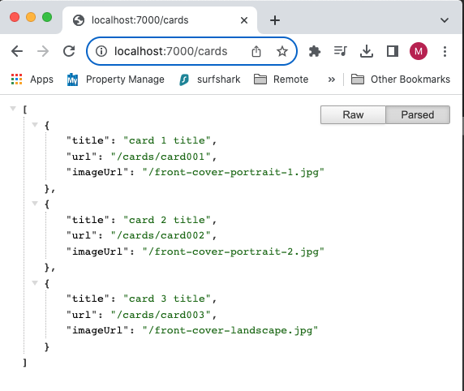
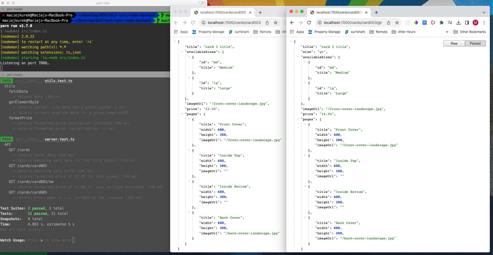

# Node API

Build a new "cards" service for the front-end, REST-like API with two endpoints

- one for returning a list of cards
- another that returns a single instance of a card.

These JSON files serve as source data - you can find them at the following URLs:

- https://moonpig.github.io/tech-test-node-backend/cards.json
- https://moonpig.github.io/tech-test-node-backend/sizes.json
- https://moonpig.github.io/tech-test-node-backend/templates.json

These are remote data sources, not to download and integrate into application locally.

## Endpoints

### `/cards`

This endpoint returns a list of cards.

- `imageUrl` should be the image found on the template that corresponds to the first page for the card.
- `url` should have the format `/cards/[id]`

Expected JSON response from `GET /cards`:

```json
[
  {
    "title": "card 1 title",
    "imageUrl": "/front-cover-portrait-1.jpg",
    "url": "/cards/card001"
  },
  {
    "title": "card 2 title",
    "imageUrl": "/front-cover-portrait-2.jpg",
    "url": "/cards/card002"
  },
  {
    "title": "card 3 title",
    "imageUrl": "/front-cover-landscape.jpg",
    "url": "/cards/card003"
  }
]
```

### `/cards/[cardId]/[sizeId]`

This endpoint returns a single card identified by its `id`. It takes an optional route parameter `sizeId` - the sizing of a card affects its price.

- `price` is calculated by the multiplying the `basePrice` of the card by the `priceMultiplier` from the selected size. If no size is provided it should default to the `basePrice`. The `basePrice` is the amount in pence and the result should be formatted as
  a string e.g. `"£2.00"`.

Expected JSON response from `GET /cards/card001/gt`:

```json
{
  "title": "card 1 title",
  "size": "gt",
  "availableSizes": [
    {
      "id": "sm",
      "title": "Small"
    },
    {
      "id": "md",
      "title": "Medium"
    },
    {
      "id": "gt",
      "title": "Giant"
    }
  ],
  "imageUrl": "/front-cover-portrait-1.jpg",
  "price": "£4.00",
  "pages": [
    {
      "title": "Front Cover",
      "width": 300,
      "height": 600,
      "imageUrl": "/front-cover-portrait-1.jpg"
    },
    {
      "title": "Inside Left",
      "width": 300,
      "height": 600,
      "imageUrl": ""
    },
    {
      "title": "Inside Right",
      "width": 300,
      "height": 600,
      "imageUrl": ""
    },
    {
      "title": "Back Cover",
      "width": 300,
      "height": 600,
      "imageUrl": "/back-cover-portrait.jpg"
    }
  ]
}
```

## Tools, Libraries and frameworks

- Express
- Jest for unit/integration testing
- Supertest for integration tests
- TypeScript

## Scripts

| Command     | Description                                             |
| ----------- | ------------------------------------------------------- |
| `yarn dev`  | run the server in development (watch) mode on port 7000 |
| `yarn test` | run tests using Jest watch mode                         |

## Screenshots

### Cards endpoint



### Card endpoint and tests for both


